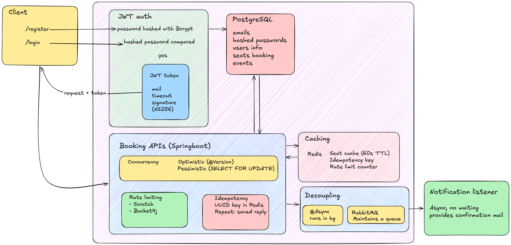

# Ticket Booking API

A Spring Boot-based ticket booking backend for managing events, seats, users, and bookings with JWT authentication, Redis-backed caching/rate limiting, RabbitMQ notifications, and concurrency-safe seat reservation logic.

## Overview

This project simulates a ticket booking system where customers can:

- Register and log in
- View available events and seat layouts
- Reserve seats for an event
- Handle booking concurrency safely
- Receive confirmation messages via RabbitMQ
- Use caching and rate limiting for API protection

The application is built with:

- Java 17
- Spring Boot 4.1.1
- Spring Data JPA
- PostgreSQL
- Redis
- RabbitMQ
- Spring Security + JWT
- Maven

## Project Structure

```text
src/
├── main/
│   ├── java/com/yash/ticketBooking/
│   │   ├── config/
│   │   │   ├── RabbitMQConfig.java
│   │   │   ├── RedisConfig.java
│   │   │   └── SecurityConfig.java
│   │   ├── controller/
│   │   │   ├── AuthController.java
│   │   │   ├── BookingController.java
│   │   │   ├── EventController.java
│   │   │   ├── SeatController.java
│   │   │   └── UserController.java
│   │   ├── entity/
│   │   │   ├── Booking.java
│   │   │   ├── BookingStatus.java
│   │   │   ├── Event.java
│   │   │   ├── Seat.java
│   │   │   ├── SeatStatus.java
│   │   │   └── User.java
│   │   ├── repository/
│   │   │   ├── BookingRepository.java
│   │   │   ├── EventRepository.java
│   │   │   ├── SeatRepository.java
│   │   │   └── UserRepository.java
│   │   ├── security/
│   │   │   ├── JwtAuthFilter.java
│   │   │   ├── JwtUtil.java
│   │   │   └── UserDetailsServiceImpl.java
│   │   ├── service/
│   │   │   ├── BookingService.java
│   │   │   ├── EventService.java
│   │   │   ├── IdempotencyService.java
│   │   │   ├── RateLimiterService.java
│   │   │   ├── SeatService.java
│   │   │   └── UserService.java
│   │   ├── DataSeeder.java
│   │   ├── NotificationListener.java
│   │   └── TicketBookingApplication.java
│   └── resources/
│       └── application.properties
├── test/
│   └── java/com/yash/ticketBooking/
│       ├── BookingConcurrencyTest.java
│       └── TicketBookingApplicationTests.java
├── Dockerfile
├── docker-compose.yml
├── pom.xml
├── .env
└── HELP.md
```

## Architecture



This diagram summarizes the main components of the system and how the application interacts with PostgreSQL, Redis, RabbitMQ, and the client layer.

## Features

### 1. User authentication and authorization

- User registration via `/auth/register`
- Login via `/auth/login`
- JWT generation and validation
- Protected booking endpoints require bearer token

### 2. Event and seat management

- Create and read events
- Fetch all seats or seats per event
- Seed data automatically if no events exist

### 3. Booking flow

- Create bookings tied to a user and seat
- Confirm seat status as booked after successful reservation
- Support both optimistic and pessimistic locking patterns

### 4. Concurrency handling

The application demonstrates two booking strategies:

- Optimistic locking: `POST /bookings/{seatId}`
  - Uses `@Version` on `Seat`
  - Throws `ObjectOptimisticLockingFailureException` when a concurrent update occurs
- Pessimistic locking: `POST /bookings/pessimistic/{seatId}`
  - Uses `@Lock(LockModeType.PESSIMISTIC_WRITE)` in `SeatRepository`
  - Prevents concurrent updates on the same seat record

### 5. Redis integration

- Seat data cache for event seat queries via `SeatService.getSeatsForEvent()`
- Cache invalidation after successful booking
- Rate limiting via `RateLimiterService`
- Idempotency handling via `IdempotencyService`

### 6. RabbitMQ integration

- Booking confirmation messages are published to a RabbitMQ exchange and route
- A listener consumes the queue and prints a simulated notification message

## Core Entities

### User

Fields:

- `id`
- `name`
- `email` (unique)
- `password`

### Event

Fields:

- `id`
- `title`
- `duration`

### Seat

Fields:

- `id`
- `seatNumber`
- `status`
- `event`
- `version` (`@Version` for optimistic locking)

### Booking

Fields:

- `id`
- `user`
- `seat`
- `bookingTime`
- `status`

## APIs

All endpoints are under the application base URL, usually `http://localhost:8080`.

### Authentication

#### Register user

- Method: `POST`
- Endpoint: `/auth/register`
- Body:

```json
{
  "name": "Alice",
  "email": "alice@example.com",
  "password": "password123"
}
```

#### Login user

- Method: `POST`
- Endpoint: `/auth/login`
- Body:

```json
{
  "email": "alice@example.com",
  "password": "password123"
}
```

Response:

```json
{
  "token": "<jwt-token>"
}
```

Add the token to requests like this:

```http
Authorization: Bearer <jwt-token>
```

### Users

#### Get all users

- `GET /users`

#### Get user by ID

- `GET /users/{id}`

#### Save user

- `POST /users`

#### Delete user

- `DELETE /users/{id}`

### Events

#### Get all events

- `GET /events`

#### Create event

- `POST /events`
- Body:

```json
{
  "title": "Winter Fest",
  "duration": "3h"
}
```

#### Get event by ID

- `GET /events/{id}`

#### Get seats for event

- `GET /events/{eventId}/seats`
- Uses Redis cache for faster repeated access

### Seats

#### Get all seats

- `GET /seats`

#### Create seat

- `POST /seats`
- Body:

```json
{
  "seatNumber": "A12",
  "status": "AVAILABLE",
  "event": {
    "id": 1
  }
}
```

#### Get seat by ID

- `GET /seats/{id}`

#### Get seats by event

- `GET /seats/event/{eventId}`

### Bookings

#### Get all bookings

- `GET /bookings`

#### Save booking manually

- `POST /bookings`

#### Get booking by ID

- `GET /bookings/{id}`

#### Delete booking

- `DELETE /bookings/{id}`

#### Book seat (optimistic locking version)

- `POST /bookings/{seatId}`
- Requires authentication
- If another user reserves the same seat at the same time, returns HTTP 409 with a message like:

```text
Seat was just booked by someone else, please pick another.
```

#### Book seat (pessimistic locking version)

- `POST /bookings/pessimistic/{seatId}`
- Requires authentication
- Requires `Idempotency-Key` header
- Uses Redis for idempotency and rate limiting

Example request:

```bash
curl -X POST http://localhost:8080/bookings/pessimistic/1 \
  -H "Authorization: Bearer <token>" \
  -H "Idempotency-Key: booking-001"
```

## Security

The application uses Spring Security with stateless JWT authentication.

Relevant configuration:

- `SecurityConfig` disables default form login/basic auth and configures JWT-based auth
- Public endpoints:
  - `/auth/login`
  - `/auth/register`
  - `/auth/**`
  - `/events/**`
- All other endpoints require authentication

JWT is generated using `JwtUtil` and validated in `JwtAuthFilter`.

## Redis Usage

Project Redis usage includes:

- Event seat cache key format:

```text
seats:event:{eventId}
```

- Rate limit key format:

```text
rate:user:{userEmail}
```

- Idempotency key format:

```text
idempotency:{idempotencyKey}
```

## RabbitMQ Usage

The application sets up a durable queue and exchange:

- Queue: `booking-notification-queue`
- Exchange: `booking-exchange`
- Routing key: `booking.confirmed`

When a booking is confirmed via the pessimistic booking flow, the system publishes the `Booking` object to RabbitMQ and `NotificationListener` logs a notification message.

## Environment Variables

The application reads connection details from environment variables or defaults.

### Docker Compose defaults

The project ships with `.env` containing:

```dotenv
DB_PASSWORD="abc@123"
```

`docker-compose.yml` wires the services as:

- PostgreSQL → `jdbc:postgresql://postgres:5432/ticket_booking`
- Redis → `redis`
- RabbitMQ → `rabbitmq`

### Local non-Docker configuration

Set the following values before running on your host machine:

```bash
export SPRING_DATASOURCE_URL=jdbc:postgresql://localhost:5432/ticket_booking
export SPRING_DATASOURCE_USERNAME=yashogale
export SPRING_DATASOURCE_PASSWORD=your_password
export SPRING_DATA_REDIS_HOST=localhost
export SPRING_RABBITMQ_HOST=localhost
```

## Running the Application

### Option 1: Docker Compose (recommended)

From the project root:

```bash
docker compose up --build
```

This starts:

- app on `http://localhost:8080`
- PostgreSQL on `localhost:5432`
- Redis on `localhost:6379`
- RabbitMQ on `localhost:5672`
- RabbitMQ management UI on `http://localhost:15672`

### Option 2: Run with Maven locally

Make sure PostgreSQL, Redis, and RabbitMQ are running, then:

```bash
./mvnw spring-boot:run
```

## Build and Test

Run the test suite:

```bash
./mvnw test
```

Build the JAR:

```bash
./mvnw clean package
```

The project includes a test for concurrent booking behavior:

- `BookingConcurrencyTest`
- It creates a seat and runs two booking tasks concurrently using the pessimistic locking path

## Docker Setup

The project has a `Dockerfile` that builds a production-style Java image:

```bash
docker build -t ticket-booking .
docker run -p 8080:8080 ticket-booking
```

## Seed Data

`DataSeeder` runs automatically on startup when the database is empty and creates:

- 1 event: `Test Concert`
- 5 seats: `1, 2, 3, 4, 5`

This is useful for quickly testing the application without manual setup.

## Notes and Caveats

- The JWT secret is currently hardcoded in `JwtUtil` and should ideally be moved to environment variables for production use.
- The project is a backend prototype and intentionally uses simple in-memory style logic for notification and validation flows.
- Security rules currently allow `/events/**` publicly, which is convenient for testing but should be tightened in a production environment.
- The app uses `spring.jpa.hibernate.ddl-auto=update`, which is fine for development but should be reviewed before production deployment.

## Example Requests

### Register a user

```bash
curl -X POST http://localhost:8080/auth/register \
  -H "Content-Type: application/json" \
  -d '{
    "name": "Alice",
    "email": "alice@example.com",
    "password": "password123"
  }'
```

### Log in

```bash
curl -X POST http://localhost:8080/auth/login \
  -H "Content-Type: application/json" \
  -d '{
    "email": "alice@example.com",
    "password": "password123"
  }'
```

### List events

```bash
curl http://localhost:8080/events
```

### Book a seat

```bash
curl -X POST http://localhost:8080/bookings/1 \
  -H "Authorization: Bearer <token>"
```

## Summary

This project is a practical Spring Boot implementation of a booking system with real-world concerns like concurrency control, caching, security, message-driven notifications, and distributed system integration. It is useful as a learning project, backend starter, and demonstration of transaction-safe seat booking patterns.
